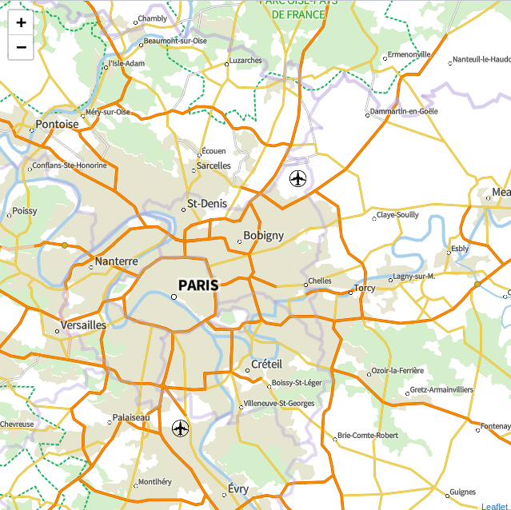

# Demo Leaflet & VectorTiles

La librairie **Leaflet** peut elle gérer correctement le *vecteur tuilé* ?

Nativement, **Leaflet** ne gère pas le vecteur tuilé, mais il existe plusieurs plugins (cf. <https://leafletjs.com/plugins.html#vector-tiles):>

* mapbox-gl-leaflet
* leaflet.vectorgrid
* mapbox.js

Liste des json :

* [osm](data/osm.json)
* [qwant](data/qwant.json)
* [planign](data/planign.json)
* [planign2](data/planign-correct.json)
* [mapbox](data/mapbox.json)



**HOWTO**

1. lancer le serveur local :
```
>$ node server.js
```

2. ouvrir le navigateur : http://localhost:9001

## 1. __mapbox-gl-leaflet__

Utilisation d'une surcouche mapbox-gl (ISC © Mapbox).

### Depôt GitHub

<https://github.com/mapbox/mapbox-gl-leaflet>

### Exemples

[exemple1](public/index-mapbox-gl1.html)
[exemple2](public/index-mapbox-gl2.html)
[exemple3](public/index-mapbox-gl3.html)
[exemple4](public/index-mapbox-gl4.html)
[exemple5](public/index-mapbox-gl5.html)
[exemple6](public/index-mapbox-gl6.html)

✔️ **OK**

```js
var token = "pk.eyJ1IjoibG93em9uZW5vc2UiLCJhIjoiY2pqNW9pM3BnMDh3YzNxc3d1NDBrOXJiYiJ9.fpJA4mi3Dau4qgEHiqdbpw";

var gl = L.mapboxGL({
    style : "mapbox://styles/mapbox/bright-v9",
    accessToken : token
}).addTo(map);
```

ou

✔️ **OK**

```js
var gl = L.mapboxGL({
    style : "data/planign.json",
    accessToken : 'no-token'
}).addTo(map);
```

### Tests avec des fichiers de styles

✔️  **OK**

[exemple](public/index-mapbox-gl6.html)

> style: 'https://s3-eu-west-1.amazonaws.com/tiles.os.uk/v2/styles/open-zoomstack-outdoor/style.json ',

> accessToken: 'no-token'

✔️ **OK**

[exemple](public/index-mapbox-gl2.html)

> style : "mapbox://styles/mapbox/bright-v9",

> accessToken : token

✔️ **OK**

[exemple](public/index-mapbox-gl5.html)

> style : "data/mapbox.json ",

> accessToken : token

❌ **NOK**

> style : "data/planign.json ",

> accessToken: 'no-token'

**Exception:**
> Error: Source layer "oro_relief" does not exist on source "plan_ign" as specified by style layer "orographie : relief - 0m"

✔️ **OK**

[exemple](public/index-mapbox-gl1.html)

> style : "data/planign-correct.json ",

> accessToken: token

On decide donc de supprimer les identifiants du fichier de style qui ne sont pas associés dans le *metadata.json* :

* oro_relief
* toponyme_routier_borne
* toponyme_routier_numero_lin
* toponyme_routier_odonyme_lin

⚠️ Par contre, il faut une clef MapBox : accessToken !? Surprenant...

✔️ **OK**

[exemple](public/index-mapbox-gl3.html)

> style : "data/qwant.json ",

> accessToken: 'no-token'

✔️ **OK**

[exemple](public/index-mapbox-gl4.html)

> style : "data/osm.json ",

> accessToken: 'no-token'

## 2. __leaflet.vectorgrid__

⚠️ **Notes:**

> Ce plugin ne permet pas d'exploiter le fichier de style ou le *metadata.json* !?

> Il faudrait donc un parser du type *ol-mapbox-style* pour transformer les objets de styles *mapbox* en objet *leaflet*... : **Parser for mapbox-like vector stylesheets**

### Depôt GitHub

<https://github.com/Leaflet/Leaflet.VectorGrid>

**API:**

<https://leaflet.github.io/Leaflet.VectorGrid/vectorgrid-api-docs.html#vectorgrid-protobuf>

### Exemple

⚠️ style unique par defaut (bleu) si aucun n'est renseigné !

[cf. exemple](public/index-vectorgrid.html)

```js
var planign = L.vectorGrid.protobuf("https://vectortiles.ign.fr/rok4server/1.0.0/PLAN.IGN/{z}/{x}/{y}.pbf", {
    rendererFactory: L.canvas.tile,
    attribution: "",
    vectorTileLayerStyles: {
        // howto styles !?
    }
    // token: "",
    // subdomains: "123",
    // key: "",
    // maxNativeZoom : 14
}).addTo(map);
```

### Parser for mapbox-like vector stylesheets

[cf. test](public/index-vectorgrid-test.html)

Faire un switch entre les 2 objets :

```json
// mapbox vector stylesheets
{
    "id":"landuse_park",
    "type":"fill",
    "source":"mapbox",
    "source-layer":"landuse",
    "filter":[
        "==",
        "class",
        "park"
    ],
    "paint":{
        "fill-color":"#d8e8c8",
        "fill-opacity":1
    }
},
```

vers

```json
// A plain set of L.Path options.
// https://leafletjs.com/reference-1.5.0.html#path
landuse_park: {
    "fillColor": "#d8e8c8",
    "fillOpacity": 1,
    "fill": false
},
```

## 3. __mapbox.js__

Mapbox JavaScript API, a Leaflet Plugin (Copyright (c), Mapbox All rights reserved)

### Depôt GitHub

<https://github.com/mapbox/mapbox.js/>

**API:**

<https://docs.mapbox.com/mapbox.js/api/v3.2.0/>

### Exemple

[cf. exemple](public/index-mapbox-js.html)

❌ **NOK**

```js
var styleLayer = L.mapbox.styleLayer("data/planign.json")
    .addTo(map);
```

**Exception:**
> les urls doivent être avec le protocole **mapbox://** !?

✔️ **OK**

```js
L.mapbox.accessToken = "<your public access token>";
var styleLayer = L.mapbox.styleLayer("mapbox://styles/mapbox/bright-v9")
    .addTo(map);
```

## 4. __OTHER__

cf. <https://github.com/mapbox/awesome-vector-tiles>
